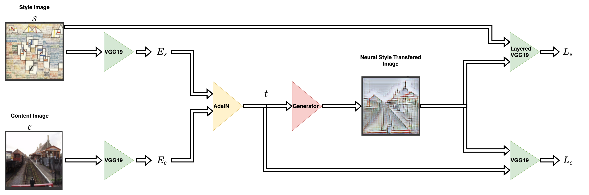
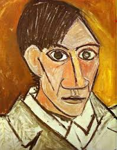
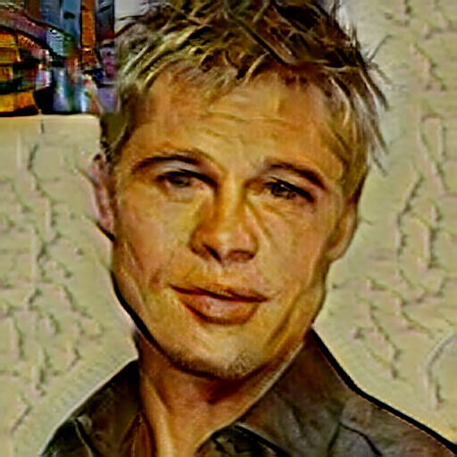
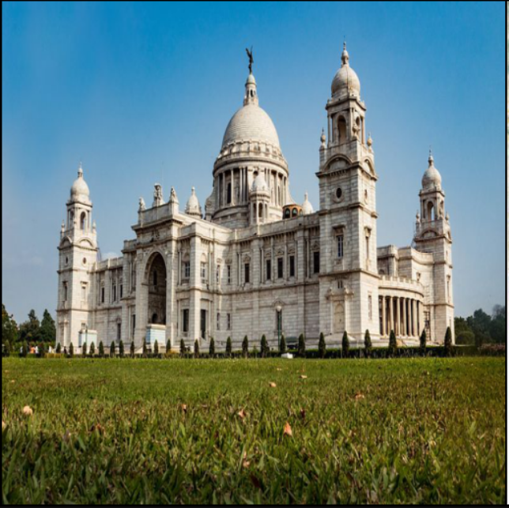
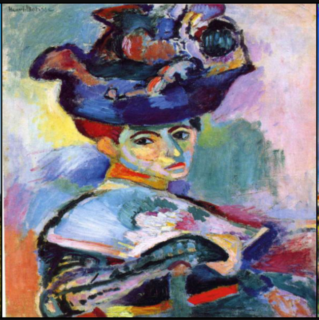
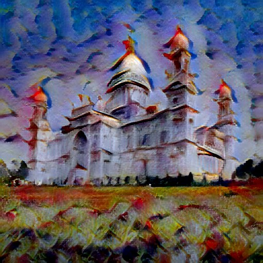
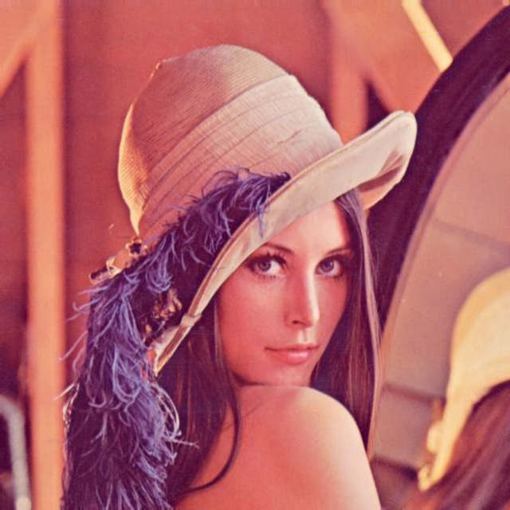
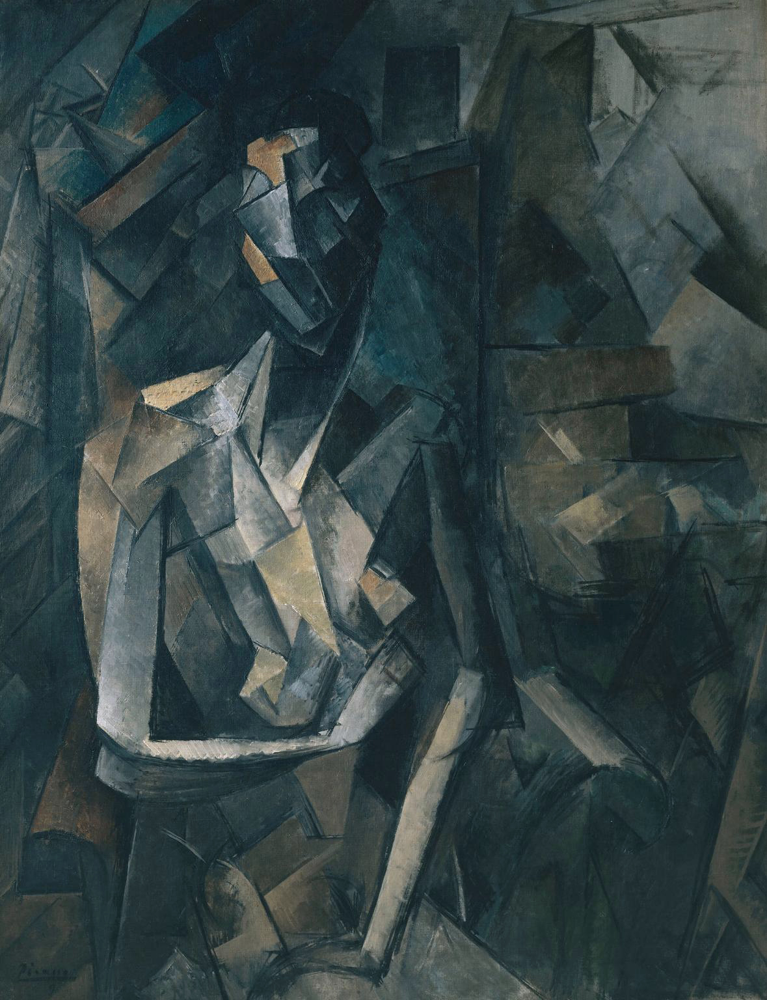
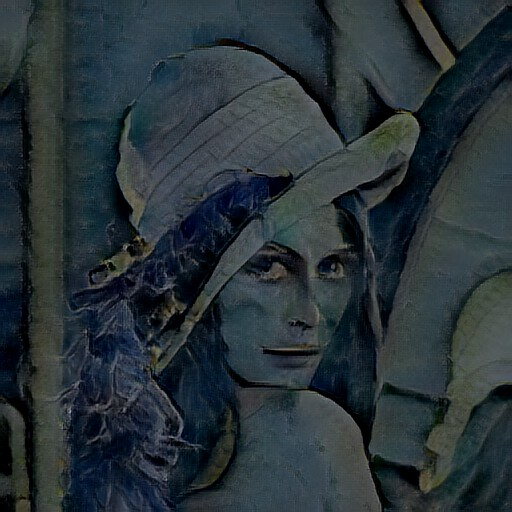

# Neural Style Transfer

<a target="_blank" href="https://cookiecutter-data-science.drivendata.org/">
    
</a>

# Architecture Diagram


# Neural Style Transfer

A complete end-to-end Neural Style Transfer system supporting images and videos, built with TensorFlow/Keras for training, ONNX for fast inference, FastAPI backend, Streamlit frontend, MLflow for model management, and AWS for cloud storage and deployment.


---

## Features
- Upload any custom style image and apply it to a content image or video.
- Pretrained style-transfer models loaded via ONNX for fast inference and lightweight docker image.
- Optional training pipeline in `notebooks/model.ipynb`.
- MLflow server in cloud to store and manage model versions.
- S3 integration: uploaded content, styles, and generated outputs stored on S3.
- FastAPI backend exposing model inference API.
- Streamlit frontend for user interaction.
- CI/CD with GitHub Actions.
- Local Kubernetes deployment using Minikube.
- Fully containerized workflow using Docker.

---

## Tech Stack

### ML & Image Processing
- TensorFlow / Keras
- ONNX Runtime
- OpenCV

### Backend
- FastAPI
- Uvicorn
- MLflow
- Docker

### Frontend
- Streamlit
- Docker

### Cloud & DevOps
- AWS EC2
- AWS S3
- AWS ECR
- GitHub Actions
- Kubernetes (Minikube)

---

## How It Works
1. User uploads **content** and **style** images/videos on the **Streamlit frontend**.
2. Frontend sends a **POST request** to the FastAPI backend with the uploaded files.
3. Backend uploads all received files to **AWS S3** and generates a **unique request ID**.
4. Backend returns this unique ID to the frontend.
5. When the user clicks **Predict**, the frontend sends a request with that unique ID.
6. Backend retrieves the stored files from S3 using the ID.
7. ONNX model processes the content + style to generate the stylized output.
8. Output image/video is uploaded back to S3.
9. Backend returns the final output to the frontend for display/download.
---

## Results
| Content | Style | Output |
|--------|--------|--------|
|  |  |  |
|  |  |  |
|  |  |  |


---
## Installation

### Clone
```
git clone https://github.com/pankaj-2708/Neural-Style-Transfer.git
cd Neural-Style-Transfer
```


### Optional Training
Open `notebooks/model.ipynb`.

---